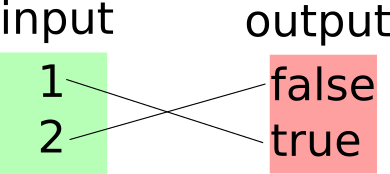

# Intro #
Author: Matt Broadway
Date: 26/10/15
Disclaimer: This is not guaranteed to be correct (but I think it is). You decide whether to believe me :)

# Isomorphisms #

### Question 1 asks: ###

"Implement an isomorphism called `enc` that encodes a function `bool -> bool`{.ocaml} into a pair `bool * bool`{.ocaml}. "

### Question 2 asks: ###

"Implement an isomorphism called `dec` that encodes a pair `bool * bool`{.ocaml} into a function `bool -> bool`{.ocaml}."

This document hopes to explain what this means and how to approach these questions.


# Background #

## Definitions ##
- A set is an unordered collection of elements. The elements could be anything, numbers, functions, characters etc. They are written like this: $\{a,\,b,\,c,\,...\}$ where $a$, $b$ and $c$ are the elements of the set.
- if two things are 'isomorphic' then it is possible to convert from one to the other and back again without loosing any information

## Sets and Types ##


In OCaml: a type, `bool`{.ocaml} for example, represents the set of all the values that something of that type could be. For example `bool`{.ocaml} is the set $\{\mathrm{false},\,\mathrm{true}\}$ because the only possible things a boolean value could be is `false`{.ocaml} or `true`{.ocaml}.

A function 'maps' between two sets. The first set contains all the possible input values to the function, and the second set contains all the possible output values 

note: these sets may be infinite, for example [big integers](http://caml.inria.fr/pub/docs/manual-ocaml/libref/Big_int.html) which have no upper or lower limit (in theory, but in practice limited by available RAM).

# First Example #



(note: I am avoiding writing a `bool -> bool`{.ocaml} function because then it is harder to see whether I'm talking about the input set or the output set. To apply this to the exercise questions, mentally replace `1` with `false` and `2` with `true`)

There is no way to specify the type: 'some of int' `-> bool`{.ocaml} in OCaml but that is what the function does in the diagram above. It maps from the integers $\{1,\,2\}$ to $\{\mathrm{false},\,\mathrm{true}\}\,==$ `bool`{.ocaml}.

Here it is written in OCaml:

```ocaml
let f = function
  | 1 -> true
  | 2 -> false
;;
```

`val f : int -> bool = <fun>`{.ocaml}

OCaml will give the warning that the pattern matching is not exhaustive. This is because we have not considered all possible inputs (all the integers) but this is exactly what `f`{.ocaml} is intended to do, it only takes `1` or `2` as an input.


`f`{.ocaml} is isomorphic to `bool * bool`{.ocaml} because we can write a pair of functions that encodes to and from these representations.

The functions should have these types, but of course OCaml doesn't understand $\{1,\,2\}$ so will just say `int`{.ocaml} instead.
```ocaml
val encode : ("{1, 2}" -> bool) -> (bool * bool)
val decode : (bool * bool) -> ("{1, 2}" -> bool)
```

We choose some scheme for filling the elements of the tuple so that every mapping (line on the diagram) is accounted for. Here the `encode`{.ocaml} function uses the first element in the tuple to store the result of `f 1`{.ocaml}, and the second element to store `f 2`{.ocaml}. This was an arbitrary choice. The only requirement is that the `decode`{.ocaml} function reverses the encode process (so the choice must be consistent over both functions).

Here is one possible pair of functions:

```ocaml
let encode f = (f 1, f 2);;

let decode (f_when_given_1, f_when_given_2) = function
  | 1 -> f_when_given_1
  | 2 -> f_when_given_2
;;
```

Alternative:

```ocaml
let encodeV2 f = (f 2, f 1);;

let decode (f_when_given_2, f_when_given_1) = function
  | 1 -> f_when_given_1
  | 2 -> f_when_given_2
;;
```

For any pair of bools, this now holds:
```ocaml
encode (decode pair_of_bools) == pair_of_bools;;

(* this also holds, but functions cannot be compared
    val f : {1, 2} -> bool
    decode (encode f) == f;;
*)
```

For example:
```ocaml
encode (decode (true, false)) == (true, false);;
```


This strategy of writing encode / decode functions applies to any function which maps (1-to-1) between finite input and output sets. Put the elements of the input set in some arbitrary order and fill the tuple elements by giving each input to the function being encoded. Then the decode function does the reverse of this.


# Exercise #
This is (one possible) solution to the exercises:

```ocaml
let enc f = (f true, f false);;

let dec (a, b) = 
  let f x = match x with
  | true -> a
  | false -> b in
  f;;
```

